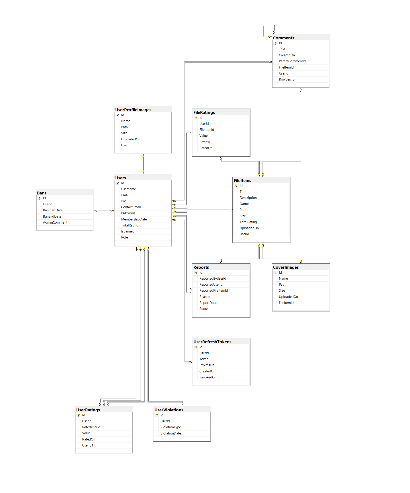
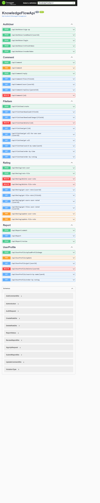

# KnowledgeFlowApi

KnowledgeFlowApi is an ASP.NET Core Web API designed for file sharing and management. Users can upload, browse, and download files, while admins can manage reports, ban users, and receive notifications for inappropriate content. The project also includes a real-time comments feature powered by **SignalR**.

---

## Features

- **File Management**:
  - Upload, browse, and download files.
  - File metadata (e.g., file name, upload date, uploaded by).

- **Reporting System**:
  - Users can report files or other users.
  - Admins review reports and take action (e.g., ban users, delete files).
  - Users are banned temporarily or permanently based on violations.

- **User Management**:
  - User registration, login, and profile management.
  - Role-based access control (Admin and User roles).
  - Ban users for violating rules.

- **Authentication and Authorization**:
  - JWT (JSON Web Tokens) for secure authentication.
  - Refresh tokens for maintaining user sessions.
  - Role-based authorization for admin-only endpoints.

- **Notifications**:
  - Email notifications for admins when a report is submitted.
  - Email notifications for users when they sign up to the system.

- **Real-Time Comments**:
  - Users can post comments on files in real-time using **SignalR**.
  - Replies to comments are supported with a self-referencing relationship.

---

## Technologies Used

- **Backend**:
  - ASP.NET Core
  - Entity Framework Core (ORM)
  - JWT (JSON Web Tokens)
  - System.Net.Mail (Email notifications)
  - System.IO.Compression (File compression)
  - SignalR (Real-time Comments)

- **Database**:
  - SQL Server

## Database Schema



## APIs



-------------------

## Getting Started

### Prerequisites

- [.NET 8 SDK](https://dotnet.microsoft.com/download/dotnet/8.0)
- [Visual Studio Code](https://code.visualstudio.com/)
- [SQL Server](https://www.microsoft.com/en-us/sql-server/sql-server-downloads)

### Installation

1. **Clone the Repository**:
   ```bash
   git clone https://github.com/MohamedM216/KnowledgeFlowApi.git
   cd KnowledgeFlowApi
  
2. **Install Required Packages**:
  ```bash
  dotnet add package Microsoft.EntityFrameworkCore.SqlServer
  dotnet add package Microsoft.AspNetCore.Authentication.JwtBearer
  dotnet add package Microsoft.EntityFrameworkCore.Tools
  dotnet add package Microsoft.AspNetCore.SignalR
  dotnet add package System.IO.Compression
  dotnet add package System.IO.Compression.ZipFile
  dotnet add package BCrypt.Net-Next
  ```

3. **Set Up the Database**:
  - Update the connection string in appsettings.json:
  ```json
  "ConnectionStrings": {
  "DefaultConnection": "Server=your-server;Database=KnowledgeFlowDb;User Id=your-user;Password=your-password;"
  }
  ```

  - Run migrations to create the database:
  ```bash
  dotnet ef migrations add InitialCreate
  dotnet ef database update
  ```
3. **Run the Application**:
  In Visual Studio Code or terminal:
  ```bash
  dotnet run
  ```

